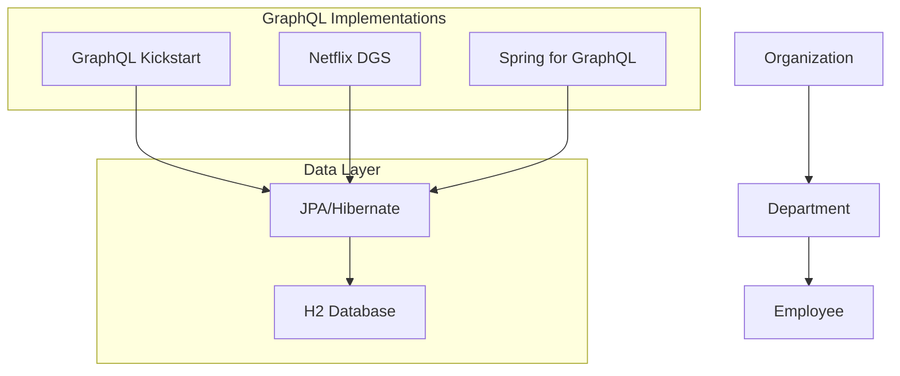
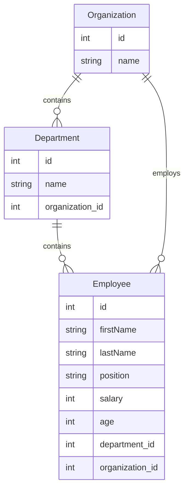

# Spring Boot GraphQL Demo Project [](https://twitter.com/piotr_minkowski)

[](https://circleci.com/gh/piomin/sample-spring-boot-graphql)
[](https://sonarcloud.io/dashboard?id=piomin_sample-spring-boot-graphql)
[](https://sonarcloud.io/dashboard?id=piomin_sample-spring-boot-graphql)
[](https://sonarcloud.io/dashboard?id=piomin_sample-spring-boot-graphql)
[](https://sonarcloud.io/dashboard?id=piomin_sample-spring-boot-graphql)

A comprehensive demonstration of different approaches to implementing GraphQL with Spring Boot, showcasing three popular libraries and their unique features.

## 🚀 Project Overview

This repository contains three independent Spring Boot applications that demonstrate different approaches to implementing GraphQL APIs. Each application implements the same domain model (Organization → Department → Employee hierarchy) using different GraphQL libraries, allowing for direct comparison of approaches and features.

## 🔗 Related Articles

1. How to simplify Spring Boot and GraphQL development with GraphQL Kickstart library. The article describes more advanced solution like filtering or joins with a database. The example is available in the branch [master](https://github.com/piomin/sample-spring-boot-graphql/tree/master/sample-app-kickstart). A detailed guide may be found in the following article: [An Advanced Guide to GraphQL with Spring Boot](https://piotrminkowski.com/2020/07/31/an-advanced-guide-to-graphql-with-spring-boot/)
2. How to simplify Spring Boot and GraphQL development with Netflix DGS library. The example is available in the branch [master](https://github.com/piomin/sample-spring-boot-graphql/tree/master/sample-app-netflix-dgs). A detailed guide may be found in the following article: [An Advanced GraphQL with Spring Boot and Netflix DGS](https://piotrminkowski.com/2021/04/08/an-advanced-graphql-with-spring-boot-and-netflix-dgs/).
3. How to simplify Spring Boot and GraphQL development with Spring for Graph library. The example is available in the branch [master](https://github.com/piomin/sample-spring-boot-graphql/tree/master/sample-app-spring-graphql). A detailed guide may be found in the following article: [An Advanced GraphQL with Spring Boot](https://piotrminkowski.com/2023/01/18/an-advanced-graphql-with-spring-boot/).

## 🏗️ Architecture



## 📦 Modules

### 1. sample-app-kickstart
**GraphQL Kickstart Library Implementation**
- Uses [GraphQL Java Kickstart](https://github.com/graphql-java-kickstart/graphql-spring-boot) library
- Resolver-based approach with separate Query and Mutation resolvers
- Built-in GraphiQL interface
- Schema-first development approach

**Key Features:**
- Schema definition through `.graphqls` files
- Resolver classes for queries and mutations
- Built-in error handling and validation
- GraphiQL playground at `/graphiql`

### 2. sample-app-netflix-dgs
**Netflix DGS Framework Implementation**
- Uses [Netflix DGS](https://netflix.github.io/dgs) (Domain Graph Service) framework
- Annotation-based data fetchers
- Code-first approach with schema generation
- Advanced context and instrumentation support

**Key Features:**
- `@DgsQuery` and `@DgsMutation` annotations
- Built-in testing utilities
- Schema generation from code
- Custom context builder support

### 3. sample-app-spring-graphql
**Spring for GraphQL Implementation**
- Uses official [Spring GraphQL](https://docs.spring.io/spring-graphql/docs/current/reference/html/) support
- Controller-based approach similar to Spring MVC
- Integrated with Spring Boot ecosystem
- Schema-first development with annotation mapping

**Key Features:**
- `@QueryMapping` and `@MutationMapping` annotations
- Native Spring Boot integration
- WebMVC and WebFlux support
- Built-in security integration

## 🗄️ Domain Model

The application models a simple organizational structure:



## 🔧 Prerequisites

- **Java 17** (Java 11 for spring-graphql module)
- **Maven 3.6+**
- **IDE** with GraphQL support (IntelliJ IDEA, VS Code with GraphQL extension)

## 🚀 Quick Start

### Clone the Repository
```bash
git clone https://github.com/piomin/sample-spring-boot-graphql.git
cd sample-spring-boot-graphql
```

### Build All Modules
```bash
mvn clean install
```

### Run Individual Applications

#### GraphQL Kickstart
```bash
cd sample-app-kickstart
mvn spring-boot:run
```
- GraphQL endpoint: `http://localhost:8080/graphql`
- GraphiQL interface: `http://localhost:8080/graphiql`

#### Netflix DGS
```bash
cd sample-app-netflix-dgs
mvn spring-boot:run
```
- GraphQL endpoint: `http://localhost:8080/graphql`
- GraphiQL interface: `http://localhost:8080/graphiql`

#### Spring for GraphQL
```bash
cd sample-app-spring-graphql
mvn spring-boot:run
```
- GraphQL endpoint: `http://localhost:8080/graphql`
- GraphiQL interface: `http://localhost:8080/graphiql`

## 📊 GraphQL Schema

All three applications implement the same GraphQL schema:

```graphql
type Query {
    # Organization queries
    organizations: [Organization]
    organization(id: ID!): Organization!
    
    # Department queries
    departments: [Department]
    department(id: ID!): Department!
    
    # Employee queries
    employees: [Employee]
    employee(id: ID!): Employee!
    employeesWithFilter(filter: EmployeeFilter): [Employee]
}

type Mutation {
    # Organization mutations
    newOrganization(organization: OrganizationInput!): Organization
    
    # Department mutations
    newDepartment(department: DepartmentInput!): Department
    
    # Employee mutations
    newEmployee(employee: EmployeeInput!): Employee
}

type Organization {
    id: ID!
    name: String!
    employees: [Employee]
    departments: [Department]
}

type Department {
    id: ID!
    name: String!
    organization: Organization
    employees: [Employee]
}

type Employee {
    id: ID!
    firstName: String!
    lastName: String!
    position: String!
    salary: Int
    age: Int
    department: Department
    organization: Organization
}

input EmployeeFilter {
    salary: FilterField
    age: FilterField
    position: FilterField
}

input FilterField {
    operator: String!  # eq, gt, lt, gte, lte, ne
    value: String!
}
```

## 🔍 Example Queries

### Query All Organizations with Departments
```graphql
query {
  organizations {
    id
    name
    departments {
      id
      name
      employees {
        id
        firstName
        lastName
        position
      }
    }
  }
}
```

### Query Employees with Filtering
```graphql
query {
  employeesWithFilter(filter: {
    salary: { operator: "gt", value: "15000" }
    position: { operator: "eq", value: "Developer" }
  }) {
    id
    firstName
    lastName
    position
    salary
    department {
      name
    }
  }
}
```

### Create New Employee
```graphql
mutation {
  newEmployee(employee: {
    firstName: "Jane"
    lastName: "Doe"
    position: "Senior Developer"
    salary: 25000
    age: 28
    organizationId: 1
    departmentId: 1
  }) {
    id
    firstName
    lastName
    position
    salary
  }
}
```

## 🧪 Testing

### Run All Tests
```bash
mvn test
```

### Run Tests for Specific Module
```bash
cd sample-app-kickstart
mvn test
```

### Test Coverage
```bash
mvn jacoco:report
```

Each module includes comprehensive test coverage for:
- GraphQL query resolvers
- Mutation resolvers
- Filtering functionality
- Error handling

## 📈 Performance Comparison

| Feature | GraphQL Kickstart | Netflix DGS | Spring GraphQL |
|---------|-------------------|-------------|----------------|
| Learning Curve | Moderate | Steep | Easy (Spring devs) |
| Performance | Good | Excellent | Good |
| Community | Active | Growing | Official Spring |
| Documentation | Comprehensive | Good | Excellent |
| Testing Support | Good | Excellent | Good |
| Schema Generation | Schema-first | Code-first | Schema-first |
| Spring Integration | Good | Excellent | Native |

## 🛠️ Technology Stack

- **Framework**: Spring Boot 3.x
- **Language**: Java 17
- **Database**: H2 (in-memory)
- **ORM**: JPA/Hibernate
- **Build Tool**: Maven
- **Testing**: JUnit 5, Spring Boot Test
- **Code Coverage**: JaCoCo
- **CI/CD**: CircleCI
- **Code Quality**: SonarCloud

## 🤝 Contributing

Contributions are welcome! Please feel free to submit a Pull Request. For major changes, please open an issue first to discuss what you would like to change.

### Development Setup
1. Fork the repository
2. Create a feature branch (`git checkout -b feature/amazing-feature`)
3. Make your changes
4. Run tests (`mvn test`)
5. Commit your changes (`git commit -m 'Add amazing feature'`)
6. Push to the branch (`git push origin feature/amazing-feature`)
7. Open a Pull Request

### Code Style
- Follow Java coding conventions
- Ensure all tests pass
- Maintain test coverage above 80%
- Update documentation for new features

## 📝 License

This project is licensed under the MIT License - see the LICENSE file for details.

## 🙋‍♂️ Support

If you have any questions or need help with the project:
- Create an issue in this repository
- Follow [@piotr_minkowski](https://twitter.com/piotr_minkowski) on Twitter
- Check out the related blog articles for detailed explanations

## 🌟 Acknowledgments

- [GraphQL Java Kickstart](https://github.com/graphql-java-kickstart/graphql-spring-boot) team
- [Netflix DGS](https://netflix.github.io/dgs) team
- [Spring GraphQL](https://docs.spring.io/spring-graphql/docs/current/reference/html/) team
- All contributors to this project
